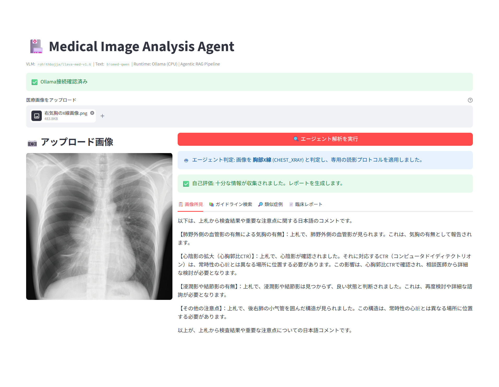
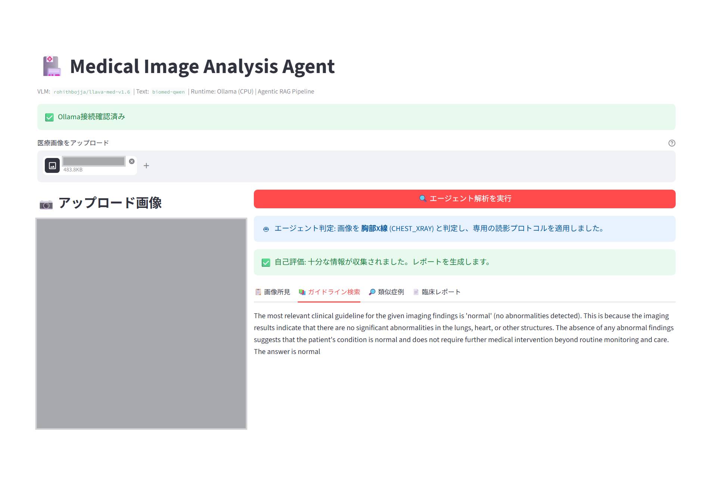
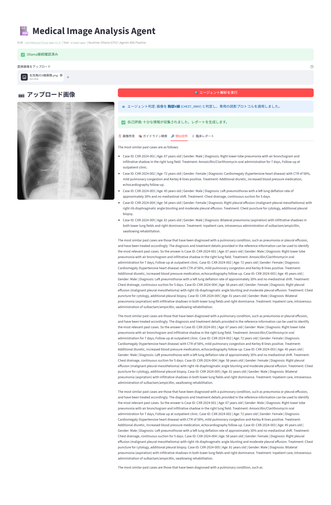
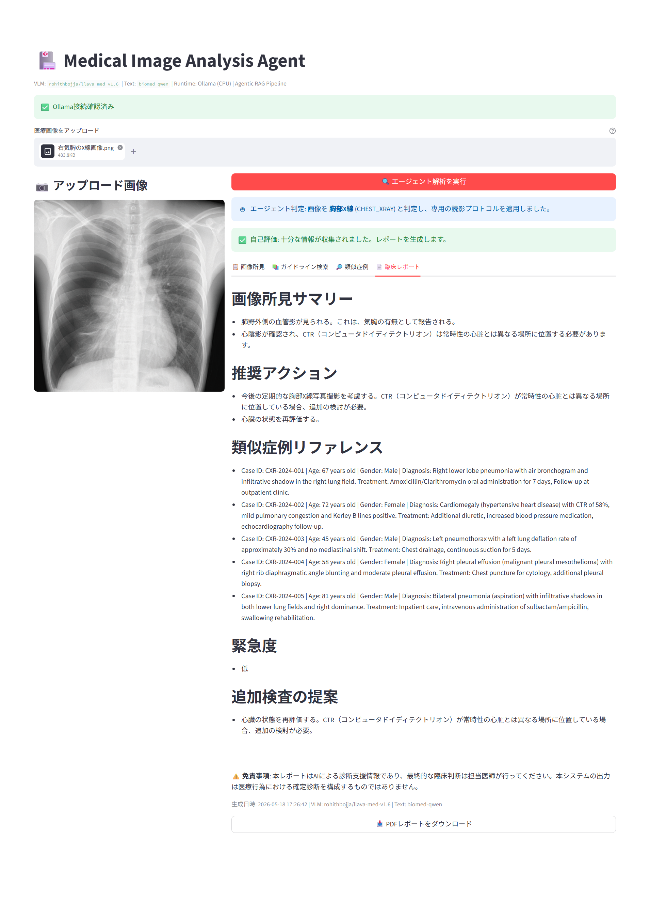

# 🏥 Medical Image Analysis Agent

医療用診断画像をVLM（Vision-Language Model）で解析し、ガイドライン検索・レポート生成まで自律的に行うAIエージェントのPoCです

## 初めに断り書きさせて頂きます
GPU非搭載のローカルPCでも一応動作しますが、1枚の画像診断で30分～60分くらいかかりました（メモリ約12GB割り当て環境）
また、非力のローカルPCで開発していたので、画像解析用LLMとして **llava-med-v1.6**, テキスト処理用として **qwen3.5:4b** を使用するのが限度でした。
若干、画像解析結果、回答文の精度は低いかもしれません

適宜、モデルを差し替えて抱くことで、精度がアップするかと思いますので、各位でお試しいただきたく存じます

## 画面イメージ
### 画像所見

### ガイドライン検索

### 類似症例

### 臨床レポート



## アーキテクチャ

```
[Streamlit UI]
      │
      ▼
┌──────────────────────────────────────────────────┐
│           Agentic Workflow Pipeline               │
├──────────────────────────────────────────────────┤
│ Step 0: モダリティ・ルーター（画像種別の自律判定）│
│    │  └→ UNKNOWN → 安全停止（ガードレール）     │
│    ↓                                             │
│ Step 1: VLM画像解析（動的プロンプト注入で精密化）│
│    ↓                                             │
│ Step 2: Agentic RAG（ガイドライン知識検索）      │
│    ↓                                             │
│ Step 3: 類似症例検索（Case Retrieval）           │
│    ↓                                             │
│ Step 4: 自己評価ループ（Self-RAG）                │
│    │  └→ INSUFFICIENT → 再検索（最大1回）       │
│    ↓                                             │
│ Step 5: 構造化臨床レポート自動生成 + PDF         │
└──────────────────────────────────────────────────┘
      │
      ▼
[Ollama API] → タスク特性に応じたモデル動的選択（CPU駆動）
      │
      ├→ 画像解析: [rohithbojja/llava-med-v1.6] (医療特化VLM・7B)
      └→ テキスト処理: [biomed-qwen] (医療特化LLM・軽量)
```

### モダリティ・ルーター（Router）と動的プロンプト注入（Dynamic Prompting）

パイプラインの最上流に「画像種別の自律判定」ステップを配置し、判定結果に応じて後続の読影プロンプトを動的に切り替えます:

```
画像アップロード → VLMがモダリティを自律分類（3回試行・多数決）
                    │
                    ├→ CHEST_XRAY → 胸部X線専用チェックリストを注入
                    ├→ BRAIN_MRI  → 脳MRI専用チェックリストを注入
                    └→ UNKNOWN    → 「医療画像として認識不可」で安全停止
```

> **Note:** VLMの分類精度が不安定なため（同一画像でも結果が変動する）、3回試行の多数決方式を採用しています。さらにUNKNOWN以外の具体的な判定が1票でもあればそちらを優先し、誤ったUNKNOWN判定による安全停止を抑制しています。

| モダリティ | 動的注入される読影チェックリスト |
|---|---|
| CHEST_XRAY | 肺紋理消失・胸膜線・縦隔偏位（気胸）、心胸郭比CTR、浸潤影・結節影・網状影、CP angle鈍化（胸水）、肋骨骨折 |
| BRAIN_MRI | 腫瘍の境界・均一性・造影パターン、T2/FLAIR浮腫、正中線偏位(mm)、脳室拡大・水頭症、脳ヘルニア徴候 |

これにより、医療特化VLMに対して「何を重点的に見るべきか」が明示され、専門性に絞った正確な所見生成が可能になります。UNKNOWNの場合はガードレールとして即時停止し、不適切な画像に対する誤診断レポートの生成を防止します。

### Agentic RAG の仕組み

本システムは「Agentic RAG（自律型検索拡張生成）」パターンを採用しています:

1. **モダリティ判定（Routing）**: VLMが画像種別を自律分類し、専用の読影プロトコルを動的に選択
2. **画像解析（Perception）**: 注入されたチェックリストに基づき、VLMが医療画像から精密な所見を抽出
3. **知識検索（Retrieval）**: LLMが所見を解釈し、模擬ガイドライン知識ベースから関連プロトコルを自律的に選択・抽出
4. **症例検索（Case Matching）**: 過去の確定診断データベースから類似症例を自律的に検索し、治療方針の参考情報を提供
5. **自己評価（Self-Evaluation）**: 検索結果の十分性をLLMが自律的に判定。不十分なら検索条件を広げて自動再検索
6. **レポート生成（Generation）**: 所見・ガイドライン・類似症例を統合し、構造化された臨床レポートを生成

従来のRAGとの違いは、検索クエリの生成・結果の評価・情報統合をすべてLLMが自律的に判断する点にあります。

### Self-RAG（自己評価ループ）

本システムは Corrective RAG パターンを採用し、検索結果の品質をエージェント自身が検証します:

```
検索完了 → 自己評価エージェントが十分性を判定
              │
              ├→ SUFFICIENT → レポート生成へ
              │
              └→ INSUFFICIENT → 検索条件を拡大して再検索（最大1回）
                                    ↓
                              レポート生成へ
```

これにより、固定パイプラインではなく「状況に応じて処理を分岐する自律的な意思決定」が実現されています。

### デュアルモデル・アーキテクチャ（タスク適応型モデル選択）

エージェントがタスク特性に応じて最適なモデルを動的に選択します:

| タスク | モデル | 選択理由 |
|--------|--------|----------|
| 画像解析（Step 0, 1） | `rohithbojja/llava-med-v1.6` | 医療画像データセットでファインチューニング済みVLM |
| テキスト処理（Step 2〜5） | `biomed-qwen` | 医療テキスト特化の軽量LLM |

メモリ12GB・CPU駆動の制約下では両モデルの同時ロードは不可能なため、Ollamaの自動モデルスワップ機構を活用しています。画像解析完了後、テキスト処理フェーズに移行する際にOllamaがVLMを自動アンロードしLLMをロードします。これにより、単一モデルでは実現できない「画像理解の専門性」と「テキスト推論の効率性」を両立しています。

## 動作環境

| 項目 | 要件 |
|------|------|
| OS | Ubuntu (WSL2) |
| Python | 3.10+ |
| メモリ | 12GB (Swap: 4GB) |
| GPU | 不要（CPU駆動） |
| Ollama | インストール済み |

## セットアップ

### 0. GitHubよりClone
```
git clone https://github.com/yutnagase/med-image-analysis-agent.git

```

### 1. Ollamaのインストールとモデル取得

```bash

# インストール前に必要なツールをインストール
sudo apt-get install zstd

# Ollamaインストール
curl -fsSL https://ollama.com/install.sh | sh

# 医療特化VLM（画像解析用）
ollama pull rohithbojja/llava-med-v1.6

# 医療特化LLM（テキスト処理用）
~~ollama pull biomed-qwen~~
ollama pull qwen3.5:4b
```

### 2. Python仮想環境のセットアップ

```bash
python3 -m venv .venv
source .venv/bin/activate
pip install -r requirements.txt
```

### 3. 日本語フォントのインストール（PDF出力用）

```bash
sudo apt install -y fonts-noto-cjk
```

## 実行方法

### Ollamaサーバー起動

```bash
ollama serve
```

> **Note:** `address already in use` エラーが出る場合、Ollamaは既にバックグラウンドで起動済みです。そのまま次に進んでください。

### Streamlitアプリ起動

```bash
streamlit run app.py
```

ブラウザで `http://localhost:8501` が自動的に開きます。

## 使い方

1. 画面上で医療画像（PNG/JPEG）をアップロード
2. 「🔍 エージェント解析を実行」ボタンをクリック
3. 6ステップのエージェント・パイプラインが順次実行される:
   - Step 0: モダリティ・ルーターによる画像種別の自律判定（UNKNOWN なら安全停止）
   - Step 1: 専用チェックリストを動的注入したVLM画像解析
   - Step 2: ガイドラインからの推奨アクション検索
   - Step 3: 過去の類似症例の検索・抽出
   - Step 4: エージェントによる自己評価（不十分なら再検索）
   - Step 5: 医師向け臨床レポートの自動生成
4. 画面上部にエージェントの判断履歴（「画像を ◯◯ と判定し、専用の読影プロトコルを適用しました」）がリアルタイム表示される
5. タブ切替で「画像所見」「ガイドライン検索結果」「類似症例」「臨床レポート」を確認
6. 「📥 PDFレポートをダウンロード」ボタンでレポートをPDF保存

## トラブルシューティング

開発中に遭遇した問題と解決策を記録しています。

### モデル名の不一致（`file does not exist`）

```
Error: pull model manifest: file does not exist
```

**原因:** Ollamaレジストリ上のモデル名は `qwen2.5vl:3b`（ハイフンなし）。`qwen2.5-vl:3b` は存在しないためマニフェスト取得に失敗する。

**解決:** ハイフンを除いた正しいモデル名を使用。
```bash
# NG
ollama pull qwen2.5-vl:3b

# OK
ollama pull qwen2.5vl:3b
```

### Ollamaサーバーの重複起動（`address already in use`）

```
Error: listen tcp 127.0.0.1:11434: bind: address already in use
```

**原因:** Ollamaはインストール時にsystemdサービスとして自動登録され、バックグラウンドで既に起動している。

**解決:** エラーではないため無視して問題なし。`ollama ps` でモデルの状態を確認可能。

### VLM画像解析時のGGMLアサーションエラー

```
GGML_ASSERT(a->ne[2] * 4 == b->ne[0]) failed
```

**原因:** 入力画像の解像度が大きすぎ、モデル内部のテンソル演算でサイズ不整合が発生。qwen2.5vl:3bのビジョンエンコーダが想定する入力サイズを超過していた。

**解決:** 画像をモデルに渡す前に512px以下にリサイズする前処理を追加。Pillowライブラリで `thumbnail()` を使用し、アスペクト比を維持したまま縮小。

```python
def resize_image(image_bytes: bytes, max_size: int = 512) -> bytes:
    img = Image.open(BytesIO(image_bytes))
    img.thumbnail((max_size, max_size))
    buffer = BytesIO()
    img.save(buffer, format="JPEG")
    return buffer.getvalue()
```

### CPU駆動でのタイムアウト

**原因:** 12GB RAM + CPU駆動で7Bパラメータモデルを推論するため、初回はモデルロード（4.8GB）＋推論で10〜15分かかる場合がある。

**解決:**
- APIタイムアウトを1200秒（20分）に設定
- `keep_alive: "30m"` でモデルのメモリ保持時間を30分に延長（デフォルト5分）
- アプリ起動時にVLMモデルを事前ウォームアップ（空プロンプトでロード完了を待機）
- 2回目以降はモデルがメモリに残るため高速化
- `ollama ps` でモデルのロード状態を確認可能

### VLMモダリティ分類の不安定性

**原因:** `rohithbojja/llava-med-v1.6` は同一画像に対しても分類結果が変動する（例: 胸部X線を `CHEST_XRAY` と判定したり `UNKNOWN` と判定したりする）。CPU駆動での量子化や推論時の数値精度が影響している可能性がある。

**解決:**
- 3回試行の多数決方式（Majority Vote）を導入
- UNKNOWN以外の具体的判定が1票でもあればそちらを優先（UNKNOWN抑制ロジック）
- トレードオフとして分類ステップの所要時間が約3倍になる

## 既知の制約

### モデルスワップによるレイテンシ

デュアルモデル構成のため、画像解析フェーズからテキスト処理フェーズへの移行時にモデルスワップが発生し、数十秒のオーバーヘッドが生じます。GPU環境であれば両モデルの同時ロードが可能になり、この問題は解消されます。

### 医療VLMの限界

`rohithbojja/llava-med-v1.6` は医療画像データセットでファインチューニングされていますが、放射線科専門医レベルの診断精度には達していません。本PoCはエージェント・アーキテクチャの技術実証を目的としており、プロダクション環境ではさらに大規模な医療特化モデルや、複数専門家モデルのアンサンブルが必要になります。

### PDF生成時の水平スペースエラー

```
Not enough horizontal space to render a single character
```

**原因:** fpdf2で `cell(w=0)` を使用した後に `multi_cell(w=0)` を呼ぶと、カーソルのX位置がページ右端に残り、残り水平スペースが0と計算される。また、デフォルトの両端揃え（justify）により、`>` のような短い文字が行末に押し出される表示崩れも発生。

**解決:**
- `content_width = pdf.w - pdf.l_margin - pdf.r_margin` で有効描画幅を事前計算し、明示的に指定
- 各 `multi_cell` の前に `set_x(l_margin)` でカーソル位置をリセット
- 全テキストに `align="L"`（左揃え）を指定し、両端揃えによる文字飛びを防止
- `pdf.output()` が `bytearray` を返すため `bytes()` で変換してStreamlitに渡す

## 注意：Ollamaモデルの可用性と仕様変更について

Ollamaの公式レジストリ（モデルライブラリ）は定期的にメンテナンスされており、非公式のカスタムモデルや古い検証用モデルは、予告なく削除または名前の変更が行われる仕様になっているようです。
そのため、過去に動作していたモデル（例: `biomed-qwen` など）が、再構築時（`ollama pull` 実行時）に `Error: pull model manifest: file does not exist` となり取得できなくなるリスクがあります。

### 万が一モデルが取得エラーになった場合の対処法

モデルがレジストリから削除されてエラーになった場合は、トリッキーな別名作成（偽装）は行わず、以下の手順で**その時点での最新の公式標準モデルに差し替える「正攻法」**での対応を推奨します。

1. **最新モデルの取得（ターミナル）**
   現在入手可能な最新の安定モデル（例: `qwen3.5:4b` など）をOllama公式からプルします。
   ```bash
   ollama pull qwen3.5:4b
   ```

2. **ソースコードの修正（VS Code）**
   本リポジトリのPythonソースコード内にあるモデル指定変数（`TEXT_MODEL` など）を、直接新しいモデル名に書き換えて保存してください。
   ```python
   # 修正例
   TEXT_MODEL = "qwen3.5:4b"  # 古い "biomed-qwen" から書き換え
   ```

## 開発ログ

| 段階 | 内容 | 課題と対応 |
|------|------|-----------|
| Step 1 | VLM画像解析PoC | モデル名の表記揺れ、CPU環境でのタイムアウト調整 |
| Step 2 | Agentic RAG + レポート生成 | 高解像度画像によるGGMLエラー → リサイズ前処理で解決 |
| Step 3 | 類似症例検索 + PDFエクスポート | 日本語PDF出力のためNoto CJKフォント統合、fpdf2のカーソル位置バグ回避 |
| Step 4 | モダリティ・ルーター + Dynamic Prompting | 一本道パイプラインから自律分岐型エージェントへ昇華。UNKNOWN判定時のガードレール（Early Exit）実装 |
| Step 5 | デュアルモデル・アーキテクチャ | 汎用VLMから医療特化モデルへ移行。タスク適応型モデル選択によりエージェントの自律性を強化 |
| Step 6 | 安定性改善 | VLM分類の不安定性を多数決方式で解決。セッション切断対策（session_state画像保存）、モデル保持時間延長（keep_alive: 30m）、ウォームアップ機構を追加 |
